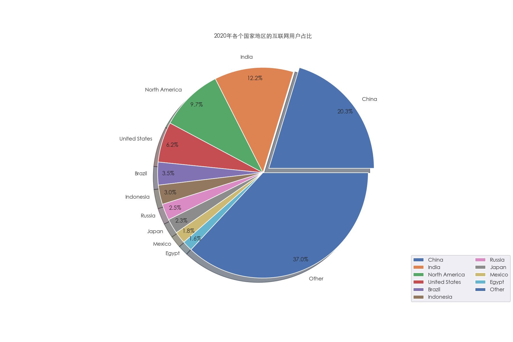
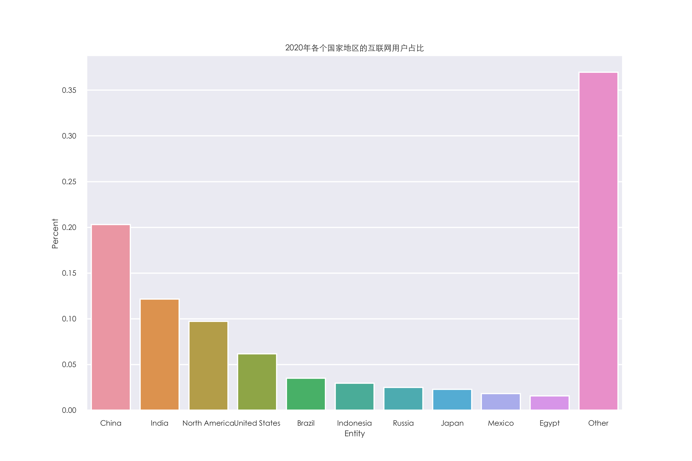
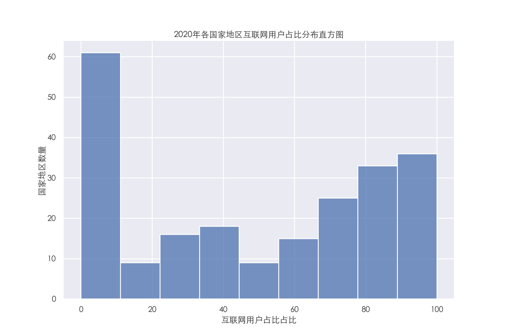
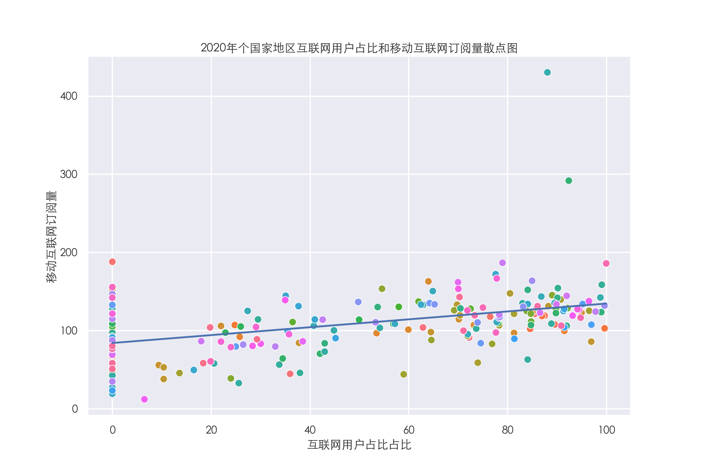
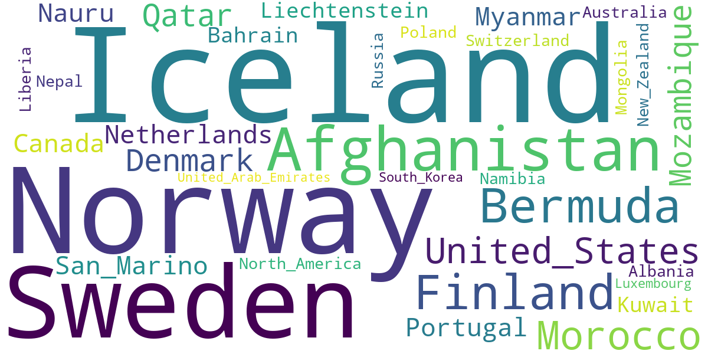
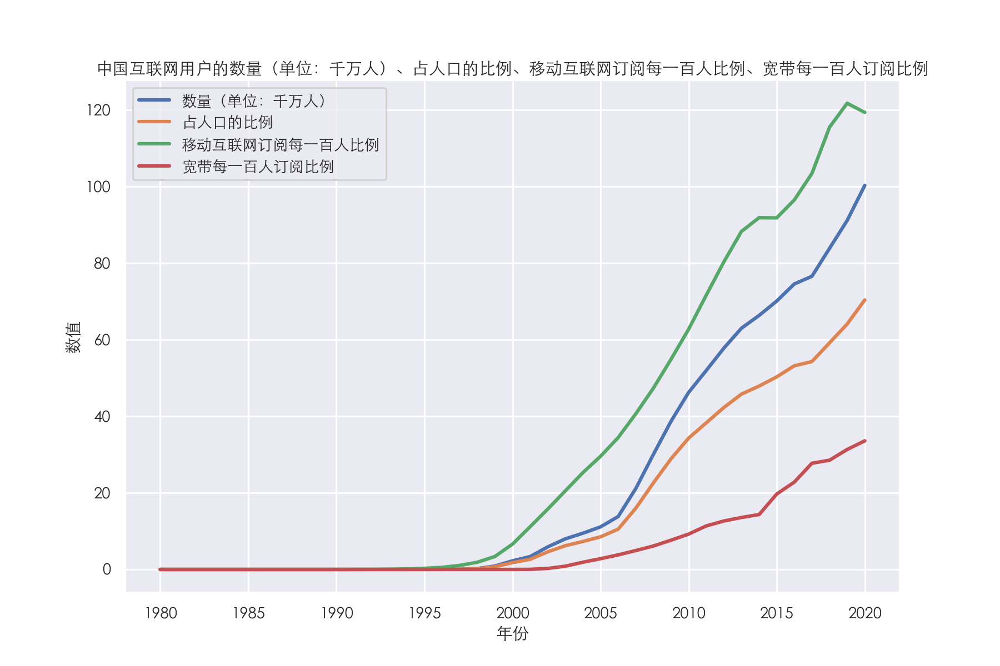
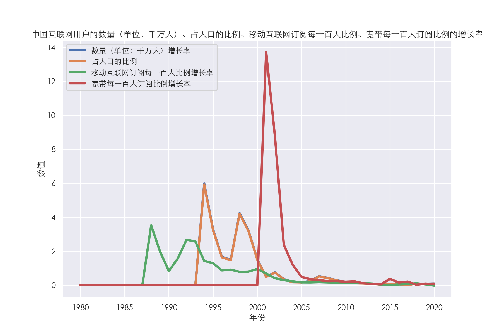
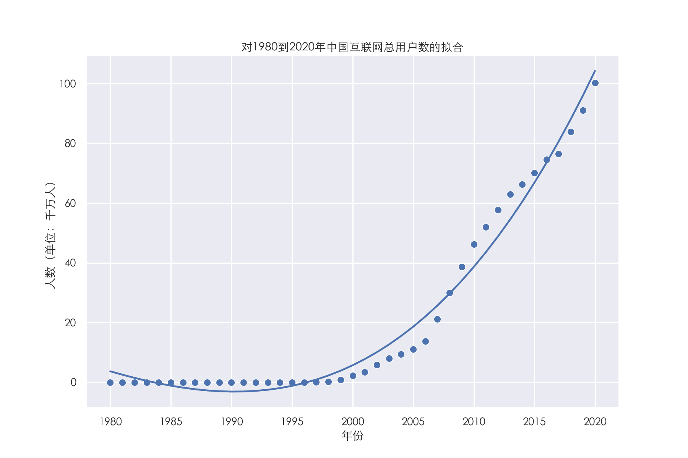
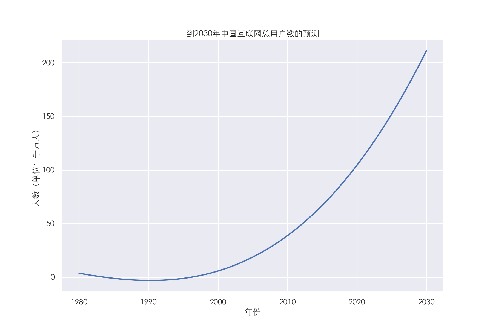

<div  align=center><font face="华文行楷" size=180>武汉理工大学</font></div>


<div align=center><h1>Python数据分析与可视化</h1></div>

<div align=center><h1>大 作 业</h1></div>


<div align=center><h3>题 目： <u>   对全球和中国互联网用户的数据分析与可视化   </u></h3></div>

   


<div STYLE="page-break-after: always;"></div>


## 一、项目概述


### 1.1. 项目背景：

互联网是当今时代最重要和最有影响力的技术之一，它已经深刻地改变了人们的生活、工作、学习等方面。互联网用户数据是反映互联网发展水平和潜力的重要指标，它可以帮助我们了解不同国家地区在互联网领域的优势和劣势，以及存在的差异和不平衡。全球互联网用户数量在过去十年中增长迅速，其中中国是全球最大的互联网市场。然而，全球和中国的互联网用户数据也存在着一些问题和挑战。通过对全球和中国的互联网用户数据进行分析和可视化，我们可以更好地把握互联网领域的变化趋势和分布情况，以及预测未来的发展方向和挑战。

### 1.2 数据来源：

数据来源于kaggle上名为Global Internet users的数据集，数据集链接：[Global Internet users | Kaggle](https://www.kaggle.com/datasets/ashishraut64/internet-users) ，该数据集包含了1980-2020年间关于全球互联网用户的信息。其中包括国家或地区名称、国家代码、年份、每100人的移动端互联网订阅数、互联网用户占总人口的比例、互联网用户数量以及每100人的宽带订阅数等信息。

### 1.3. 程序功能：

分析和可视化全球用户每年的各项数据，如互联网用户总数、移动端互联网订阅数、互联网使用人数比例、宽带订阅数等。

   - 绘制 2020 年各个国家地区的用户占比饼图和柱状图，展示全球互联网用户占比的分布情况和差异。
   - 绘制 2020 年各国家地区互联网用户占比分布直方图，展示全球互联网用户占比的分布特征和偏态。
   - 绘制 2020 年个国家地区互联网用户占比和移动互联网订阅量的散点图，并利用线性回归模型分析两者之间的相关性。
   - 绘制每一年互联网用户的比例最大的三个国家地区名的词云，展示全球互联网领域的优势和影响力。
   - 对中国互联网用户数据进行分析和可视化，展示中国在互联网领域的发展水平和潜力，并利用多元线性回归模型预测中国互联网到 2050 年的总用户数。

### 1.4. 所使用第三方库介绍：

   - numpy 库：用于进行数值计算，如数组、矩阵、向量等的创建、操作和运算。

   - pandas 库：用于处理数据，如数据的读取、清洗、分组、聚合、合并等。
   - matplotlib 库：用于绘制图形，如折线图、柱状图、饼图等，以及设置图形的样式、标题、标签等。
   - seaborn 库：用于绘制图形，如直方图、散点图等，以及设置图形的主题、颜色等。
   - wordcloud 库：用于配置和生成词云，如设置词云的形状、大小、字体等。
   - sklearn 库：用于进行线性回归分析，如创建线性回归模型、拟合数据、预测数据、评估模型等。


## 二、 功能实现


### 2.1. 数据读取和工具函数的实现

使用 `read_csv` 函数读取 `Final.csv` 文件，获取全球互联网用户信息，定义两个工具函数`set_seaborn_properties`、`get_2020_entities_dataframe`。

```python
# 从数据集中读取出所有的数据
global_users = pd.read_csv('../data/Final.csv', delimiter=',', usecols=range(1, 8))

# 此函数用于配置每个seaborn图的主题，其中提供了一些默认配置，需要修改的配置在参数中提供，根据图的美观性和实用性需要改变参数
def set_seaborn_properties(context='talk', font_scale=0.8)

# 此函数用于获取所有Entity的2020年数据组成的DataFrame
def get_2020_entities_dataframe()
```

### 2.2. 全球用户每年的各项数据的分析与可视化

定义一个名为 `global_internet_users_analysis` 的函数，用于分析和可视化全球用户每年的各项数据。在这个函数中，使用 matplotlib 和 seaborn 库绘制了全球每年的互联网用户总数、全球每年每100人移动端互联网订阅数、互联网使用人数比例、每100人宽带订阅数的平均值等图形。

``````python
plt.subplot(2, 2, 1)  # 绘制子图
sns.lineplot(data=internet_users_sum_data, x='Year', y='sum')  # 折线图
plt.bar(column_mean.index, column_mean.values, color='cornflowerblue', width=0.6)  # 配合折线图使构图饱满

for column in ['Cellular Subscription', 'Internet Users(%)', 'Broadband Subscription']:
    plt.subplot(2, 2, i)
    i += 1
    # 最大值
    sns.lineplot(data=max_data, x='Year', y='max', label=column + ' max', lw=2, linestyle=(0, (5, 1)))
    # 平均值
    sns.lineplot(data=mean_data, x='Year', y='mean', label=column + ' mean', lw=3, linestyle=(0, (1, 1)))
``````


从图中可以看出：

- 全球互联网用户总数呈现出一个快速增长的趋势，尤其是在 2000 年之后，增长速度更加明显。这说明互联网技术的发展和普及，以及人们对互联网的需求和依赖都在不断增加。

- 全球每100人移动端互联网订阅数也呈现出一个快速增长的趋势，尤其是在 2005 年之后，增长速度更加明显。这说明移动设备的普及和便捷，以及人们对移动互联网的需求和偏好都在不断增加。

- 全球互联网使用人数比例也呈现出一个快速增长的趋势。这说明互联网已经成为人们生活、工作、学习等方面不可或缺的一部分，以及互联网的覆盖范围和接入方式都在不断扩大和改善。

- 全球每100人宽带订阅数呈现出一个缓慢增长的趋势，但在 2010 年之后，增长速度有所放缓。这说明宽带网络的发展和普及还有一定的空间和潜力，以及宽带网络的竞争力和吸引力可能受到了移动网络的影响。

  

### 2.3. 2020年各个国家地区的用户占比饼图和柱状图绘制

定义了一个名为 `entities_2020_internet_users_percentage_pie_bar` 的函数，用于绘制 2020 年各个国家地区的用户占比饼图和柱状图。在这个函数中，首先获取 2020 年国家地区用户数量最多的10组数据，其他数据用`other`代替的数据封装成的 DataFrame，使用 matplotlib 和 seaborn 库绘制饼图和柱状图。

```python
# 只筛选用户数量最多的10组数据，其他数据用`other`代替
entity_2020_df.sort_values(by='No. of Internet Users', axis=0, ascending=False, inplace=True)
processed_data = pd.concat([entity_2020_df.head(10), other_df], axis=0, join='outer')

# 绘制饼图
plt.pie(processed_data['No. of Internet Users'], labels=processed_data.index, explode=explode_arr,
            labeldistance=1.1, autopct='%2.1f%%', pctdistance=0.9, shadow=True)

# 绘制柱状图
sns.barplot(data=data, x='Entity', y='Percent')
```






从图中可以看出：

- 在 2020 年，全球互联网用户占比最高的国家地区是中国，占比达到了 20.3%，远高于其他国家地区。这说明中国在互联网领域有着巨大的市场规模和潜力，以及中国在互联网技术、应用、服务等方面有着较强的竞争力和影响力。

- 在 2020 年，全球互联网用户占比第二高的国家地区是印度，占比为 12.1%，但与中国相比还有较大的差距。这说明印度在互联网领域也有着较大的市场规模和潜力，但与中国相比还有较大的发展空间和挑战。

- 在 2020 年，全球互联网用户占比第三高的国家地区是南美，占比为 9.7%，与印度相比较为接近。这说明美国在互联网领域也有着较大的市场规模和潜力，但与中国相比也有较大的差距。

- 在 2020 年，全球互联网用户占比排名前十的国家地区还包括巴西、印度尼西亚、俄罗斯、日本、墨西哥和埃及。这些国家地区的占比都在 1.5% 到 3.6% 之间，相对较低。这说明这些国家地区在互联网领域还有较大的发展空间和潜力，但也面临着较大的挑战和竞争。

- 在 2020 年，全球互联网用户占比排名第十一以后的国家地区的占比加起来只有 约37%，远低于中国的占比。这说明这些国家地区在互联网领域还有较大的不平衡和差距，需要加强互联网技术的普及和提升。

  

### 2.4. 2020年各国家地区互联网用户占比分布直方图

定义了一个名为 `entities_2020_internet_users_percentage_distribution_histogram` 的函数，用于绘制 2020 年各国家地区互联网用户占比分布直方图。在这个函数中，首先获取 2020 年国家地区数据封装成的 DataFrame，然后使用 seaborn 库绘制了直方图。

```python
# 获取数据
data = pd.DataFrame({'Entity': internet_users_percentage_sr.index, 'Percent':internet_users_percentage_sr.values})

# 绘制直方图
sns.histplot(data, x='Percent')
```




从图中可以看出：

- 在 2020 年，各国家地区互联网用户占比的分布呈现出一个右偏态的分布，大部分国家地区的互联网用户占比都集中在较低的范围内，而少数国家地区的互联网用户占比则达到了较高的水平。

- 在 2020 年，各国家地区互联网用户占比的最高值为 100%，最低值为 0%，平均值为 47.9%，中位数为 53.9%，标准差为 36.1%。这说明各国家地区互联网用户占比存在着较大的差异和不平衡，以及部分国家地区的互联网发展水平还有较大的提升空间。

  

### 2.5. 2020年个国家地区互联网用户占比和移动互联网订阅量的散点图

定义了一个名为 `entities_2020_internet_users_percentage_distribution_scatter` 的函数，用于绘制 2020 年个国家地区互联网用户占比和移动互联网订阅量的散点图。在这个函数中，首先获取 2020 年国家地区数据封装成的 DataFrame，然后使用 seaborn 库绘制了散点图，并利用 sklearn 库中的线性回归模型分析两者之间的关系。

```python
# 绘制散点图
sns.scatterplot(data=entity_2020_df, x='Internet Users(%)', y='Cellular Subscription',
                    palette='husl', hue='Entity', legend=None)  # 根据地区设置hue参数，使颜色丰富


# 一元线性回归分析两者关系
x = entity_2020_df[['Internet Users(%)']]
model_1 = linear_model.LinearRegression()
model_1.fit(x, entity_2020_df[['Cellular Subscription']])
data = pd.DataFrame({'x': x['Internet Users(%)'], 'pred_y': [x[0] for x in model_1.predict(x)]})
sns.lineplot(data=data, x='x', y='pred_y')
```




从图中可以看出：

- 在 2020 年，各国家地区互联网用户占比和移动互联网订阅量呈现出一个正相关的关系，即互联网用户占比越高的国家地区，移动互联网订阅量也越高，反之亦然。这说明互联网用户占比和移动互联网订阅量是两个相互影响和促进的指标，反映了一个国家地区的互联网发展水平和便捷程度。

  

### 2.6. 用每一年互联网用户的比例最大的三个国家地区名生成词云

定义了一个名为 `draw_internet_users_percentage_annual_top_3_wordcloud` 的函数，用于绘制每一年互联网用户的比例最大的三个国家地区名生成词云。在这个函数中，首先获取每一年互联网用户的比例最大的三个国家地区名，然后使用 wordcloud 库绘制词云。

```python
text = ''
year_groups = global_users.groupby('Year')
# 获取每一年互联网用户的比例最大的三个国家地区名数据
for year, year_df in year_groups:
    year_df.sort_values(by='Internet Users(%)', ascending=False, inplace=True)
    top_3 = year_df.head(3)
    entities = top_3['Entity']
    # 数据处理
    for entity in entities:
        if len(entity.split()) > 1:
            text += entity.replace(' ', '_') + ' '  
            # 将名字中含有空格的国家地区名中的空格替换成下划线_，避免一个名字被拆分成多个单词
        else:
            text += entity + ' '

# 绘制词云
wc = WordCloud(max_words=100, width=800, height=400, background_color='White',
               max_font_size=150, stopwords=STOPWORDS, margin=5, scale=1.5)
wc.generate(text)
plt.imshow(wc)
plt.axis("off")
plt.show()
```




从图中可以看出：

- 在 1980-2020 年间，出现频率最高的国家地区名是 Iceland、Norway和Sweden。这说明这些国家地区在互联网领域有着长期的较高的发展水平和优势，以及较高的人口普及率和接入率。

- 在 1980-2020 年间，出现频率较高的国家地区名还有 Bermuda、Denmark、Finland、Moracco、Afghanistan和 United_States等。这说明这些国家地区在互联网领域也有着长期的较高的发展水平和优势，以及较高的人口普及率和接入率。

- 在 1980-2020 年间，出现频率较低或没有出现的国家地区名有 China、India、Brazil、Indonesia 等。结合2.4中的结果，这些国家地区有些是后起之秀，如中国和印度，有些则在互联网领域还有较大的发展空间和潜力，如巴西和印度尼西亚。

  

### 2.7. 对中国互联网用户数据的分析与可视化

最后，我们定义了一个名为 `chinese_users_analysis` 的函数，用于对中国互联网用户数据进行分析和可视化。首先通过切片获取中国互联网用户信息。然后使用 matplotlib 和 seaborn 库绘制了各项指标的数值图和增长率图，并利用 sklearn 库中的多元线性回归模型预测中国互联网到 2050 年的总用户数。

```python
# 基本信息的折线图
sns.lineplot(data=chinese_users, x='Year', y='No. of Internet Users', label='数量（单位：千万人）', lw=3)
sns.lineplot(data=chinese_users, x='Year', y='Internet Users(%)', label='占人口的比例', lw=3)
sns.lineplot(data=chinese_users, x='Year', y='Cellular Subscription', label='移动互联网订阅每一百人比例', lw=3)
sns.lineplot(data=chinese_users, x='Year', y='Broadband Subscription', label='宽带每一百人订阅比例', lw=3)
```




从图中可以看出：

- 中国互联网用户数量呈现出一个快速增长的趋势，尤其是在 2000 年之后，增长速度更加明显。这说明中国在互联网领域有着巨大的市场规模和潜力，以及中国在互联网技术、应用、服务等方面有着较强的竞争力和影响力。

- 中国互联网用户占人口比例也呈现出一个快速增长的趋势，尤其是在 2005 年之后，增长速度更加明显。这说明中国在互联网领域有着较高的普及率和接入率，以及中国在互联网领域的需求和依赖都在不断增加。

- 中国移动互联网订阅每一百人比例也呈现出一个快速增长的趋势，尤其是在 2005 年之后，增长速度更加明显。这说明中国在移动设备领域有着较高的普及率和便捷程度，以及中国在移动互联网领域的需求和偏好都在不断增加。

- 中国宽带每一百人订阅比例呈现出一个缓慢增长的趋势，但在 2017 年之后，增长速度有所放缓。这说明中国在宽带网络领域还有一定的空间和潜力，以及中国在宽带网络领域的竞争力和吸引力可能受到了移动网络的影响。

  ```python
  # 计算各项增长率
  rows = len(chinese_users.index)
  for i in range(rows - 1):
      chinese_users.loc[:, 'increase of No. of Internet Users'].iloc[i + 1] = 0 if chinese_users.iloc[i]['No. of Internet Users'] == 0 else (chinese_users.iloc[i + 1].loc['No. of Internet Users'] - chinese_users.iloc[i]['No. of Internet Users']) / chinese_users.iloc[i]['No. of Internet Users']
  ······
  
  # 绘制图形
  sns.lineplot(data=chinese_users, x='Year', y='increase of No. of Internet Users', lw=4,
                   label='数量（单位：千万人）增长率')
  ······
  ```

  



从图中可以看出：

- 中国互联网用户数量增长率和占人口比例增长率基本为同比增长，在1993-2005年之间增长较快之后趋于平稳，这说明中国在互联网领域已经达到了一个较高的发展水平，中国在互联网正在稳步发展。

- 中国移动互联网订阅每一百人比例增长率呈现在1987-2005年之间增长较快之后趋于平稳，尤其是在 2010 年之后，这说明中国在移动设备领域已经达到了一个较高的普及率和便捷程度，以及中国在移动互联网领域已形成良好发展趋势。

- 中国宽带每一百人订阅比例增长率在2000-2002年飞速增长之后又下降并趋于平稳。这说明中国在宽带网络领域有一定的空间和潜力，以及中国在宽带网络领域有着较强的竞争力和吸引力。

  ```python
  # 散点图
  sns.scatterplot(data=chinese_users, x='Year', y='No. of Internet Users')
  
  # 三元线性回归拟合
  poly_reg = PolynomialFeatures(degree=3)
  ······
  model_2.fit(x_m, chinese_users[['No. of Internet Users']])
  data = pd.DataFrame({'x': x['Year'], 'pred_y': [x[0] for x in model_2.predict(x_m)]})
  
  # 绘制折线图
  sns.lineplot(data=data, x='x', y='pred_y')
  ```

  



从图中可以看出：

- 我们使用 sklearn 库中的多元线性回归模型对 1980 到 2020 年中国互联网总用户数进行了拟合，得到了一个拟合曲线。这个曲线可以用来描述中国互联网总用户数随时间的变化规律，以及评估拟合效果和意义。

  ```python
  # 预测
  pred_x = pd.DataFrame(np.arange(1980, 2031), columns=['Year'])
  pred_x_m = poly_reg.fit_transform(pred_x)
  
  # 绘图
  plt.plot(pred_x, model_2.predict(pred_x_m))
  ```

  



从图中可以看出：

- 到2030年中国互联网总用户数将达到21.1亿，此预测具有一定的合理性，因为中国互联网用户的各项指标都在飞速增长，中国互联网具有很大的发展潜力与发展活力。
- 但是此预测也具有一定的局限性，这个预测仅仅只用了一个数据集，没有考虑中国具体国情，仅仅依托数量的线性增长来分析是不合理的，需要更加高级的模型，并且要兼顾中国人口老龄化问题，结合中国人口增长速度来进一步分析，这样的预测效果会更好。


